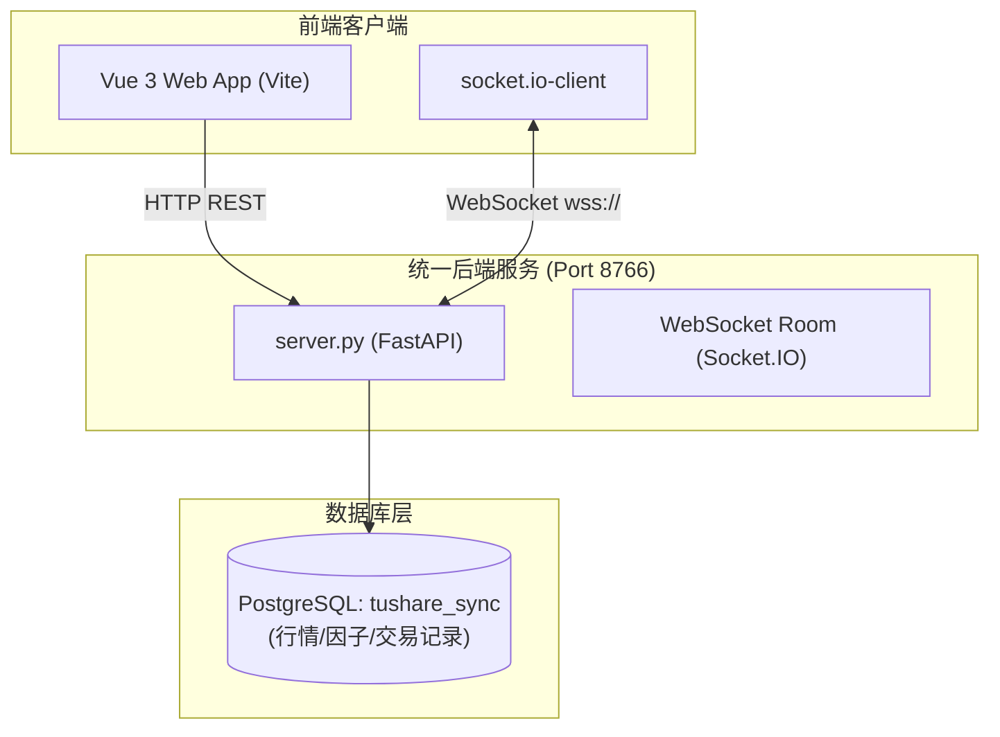

# 华璟智璇 量化交易系统 - 架构设计说明 (ARCHITECTURE.md)

本项目完整的系统架构设计文档已整理至：
👉 **[docs/ARCHITECTURE.md](file:///Users/wangjiangtao/Documents/AI/AI-trading-web/docs/ARCHITECTURE.md)**

---

## 核心架构概览

本系统采用 **前后端分离** 的分布式/微服务化架构。在开发和生产运行中，所有后端功能路由及实时推送网关被高度整合在统一的进程中运行。

### 快速文档索引
- 完整系统架构设计：[docs/ARCHITECTURE.md](file:///Users/wangjiangtao/Documents/AI/AI-trading-web/docs/ARCHITECTURE.md)
- 数据库结构说明：[docs/DATABASE.md](file:///Users/wangjiangtao/Documents/AI/AI-trading-web/docs/DATABASE.md)
- 环境与 API 映射对照：[docs/ENV_MAPPING.md](file:///Users/wangjiangtao/Documents/AI/AI-trading-web/docs/ENV_MAPPING.md)
- AI 协作与约束：[AI_CONTEXT.md](file:///Users/wangjiangtao/Documents/AI/AI-trading-web/AI_CONTEXT.md)
