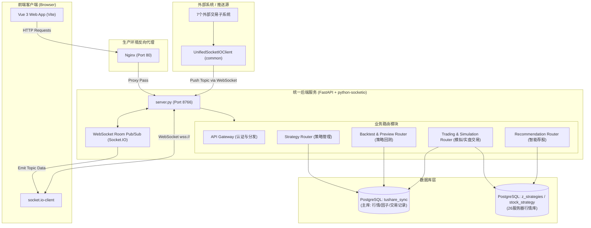

# 华璟智璇 量化交易系统 - 系统架构文档 (ARCHITECTURE.md)

本文件详细阐述了**华璟智璇量化交易系统（AI Trading Web）**的整体架构设计、技术栈选型、目录结构、前后端逻辑架构、WebSocket 实时推送系统、数据库设计以及多环境部署运维方案。

---

## 1. 整体架构拓扑 (Mermaid)

系统采用前后端分离的架构，后端各微服务模块在运行期间通过一个统一的 ASGI 入口服务（`server.py`）整合在一起，结合高并发的 WebSocket (Socket.IO) 实时推送机制，与前端进行数据和指令的双向交互。



---

## 2. 技术栈选型

### 前端技术栈 (Web Client)
- **核心框架**: Vue 3.4.21 (使用 Composition API & `<script setup>` 语法糖)
- **构建工具**: Vite 5.2.10 + TypeScript 5.4.5
- **状态管理**: Pinia (配合 Composition API 风格定义 Store)
- **路由管理**: Vue Router 4.3.2
- **UI 组件库**: Ant Design Vue 4.1.2 + Lucide/Material Icons (系统图标)
- **样式方案**: Tailwind CSS 3.4.4 + Vanilla CSS 自定义主题变量 (支持暗黑/明亮模式切换)
- **通信客户端**: `socket.io-client` (实时全双工连接)

### 后端技术栈 (Backend)
- **核心语言**: Python 3.9+
- **Web 框架**: FastAPI (高性能 ASGI 异步 Web 框架)
- **实时通信**: `python-socketio` (基于 ASGI 模式运行)
- **ORM 框架**: SQLAlchemy (异步驱动 `asyncpg`) + Alembic (版本迁移预留)
- **数据库**: PostgreSQL (主存行情、因子、基础信息、回测及模拟交易数据)
- **运行依赖**: `uvicorn` (ASGI 服务器), `python-dotenv` (开发环境变量加载), `httpx` (异步 HTTP 客户端)

---

## 3. 项目仓库目录结构

项目采用单仓库 (Monorepo) 方式管理前后端代码，标准仓库根目录结构如下：

```text
ai-trading-web/
├── AI_CONTEXT.md              # AI 上下文与约束基线
├── AGENTS.md                  # AI 协作与开发规范
├── README.md                  # 项目部署与快速启动指南
├── PORTS.md                   # 端口分配表
├── docs/                      # 系统文档目录
│   ├── ARCHITECTURE.md        # 系统架构设计文档 (本文件)
│   ├── DATABASE.md            # 数据库结构与表结构定义
│   ├── ENV_MAPPING.md        # 环境与 API 映射对照
│   ├── plan.md                # 阶段性开发计划
│   ├── progress.md            # 项目开发进度记录
│   └── API/                   # 核心业务 REST API 接口定义目录
├── design/                    # 设计规范与静态 UI 拼接稿 (HTML)
├── web-client/                # 前端系统工程根目录
│   ├── src/
│   │   ├── api/               # API 封装与请求定义
│   │   ├── components/        # 共享组件与布局组件
│   │   │   ├── backtest/      # 回测专用组件
│   │   │   ├── common/        # 通用原子级组件
│   │   │   ├── features/      # 业务特性复杂组件
│   │   │   └── layout/        # 全局布局 (MainLayout, SimpleLayout)
│   │   ├── composables/       # 组合式函数 (如 useWebSocket, useTheme)
│   │   ├── router/            # 前端路由配置 (index.ts)
│   │   ├── stores/            # Pinia 状态 Store (auth, user, etc.)
│   │   ├── views/             # 页面级容器组件 (Home, Recommendation, etc.)
│   │   ├── App.vue            # 前端应用入口壳
│   │   └── main.ts            # 前端打包入口
│   ├── package.json           # 前端依赖配置
│   └── vite.config.ts         # Vite 构建配置
└── backend/                   # 后端服务工程根目录
    ├── server.py              # 统一的后端主入口 (合并运行 Gateway & WebSockets)
    ├── requirements.txt       # 后端 Python 依赖包列表
    ├── common/                # 后端公共基础设施模块 (数据库连接、WS 客户端等)
    ├── gateway/               # 认证、鉴权与网关路由逻辑
    ├── data_sync/             # 数据同步微服务 (从 Tushare 同步行情等)
    ├── strategy/              # 策略生命周期管理模块
    ├── backtest/              # 策略回测执行引擎 (含 routers, models, src)
    ├── trading/               # 交易微服务 (模拟交易、实盘对接、行情查询)
    └── recommendation/        # 智能荐股与资讯提取服务
```

---

## 4. 前端架构与布局原则

### 4.1 全局单例布局
系统采用高度内聚的全局布局架构，由 `web-client/src/components/layout/MainLayout.vue` 承载：
- **Header 顶栏 (高度 48px)**: 包含系统 Brand Logo（点击跳转首页）、系统名称（华璟智璇 量化交易系统）、全局主题切换组件、通知中心及退出登录。
- **Sidebar 侧边栏 (宽度 176px)**: 统一控制十个核心业务页面的导航：
  1. 首页 (`/`)
  2. 智能荐股 (`/recommendation`)
  3. 宏观日历 (`/macro-calendar`)
  4. 因子看板 (`/factor-board`)
  5. 策略回测 (`/backtest`)
  6. 模拟交易 (`/simulation`)
  7. 股票交易 (`/trading`)
  8. 交易终端 (`/trading-terminal`)
  9. 策略交易 (`/strategy-trading`)
  10. 风控系统 (`/risk-control`)
- **Main 业务展示区**: 所有业务视图作为子路由渲染于 `MainLayout` 内的 `<RouterView>` 挂载点中，绝不允许为单个业务视图构建独立的外层导航。

### 4.2 前端 WebSocket 生命周期
前端采取 **“全局物理连接 + 页面局部订阅”** 的管理机制：
1. **全局建立连接**: 在 `App.vue` 初始化时建立唯一的 `Socket.IO` 物理连接，避免页面切换时重复断开与握手。
2. **动态进入订阅**: 子页面组件挂载时 (`onMounted`)，调用 `useWebSocket().subscribe(['topic_name'])` 订阅对应主题。
3. **离开自动退订**: 子页面组件卸载时 (`onUnmounted`)，调用 `useWebSocket().unsubscribe(['topic_name'])` 仅退出 Room 订阅，但保持物理连接处于 Established 状态。

---

## 5. 后端服务架构与 WebSocket 通信机制

### 5.1 集中式网关与合并运行
虽然设计上划分为多个微服务，但在实际运行时，后端通过 `backend/server.py` 将所有服务整合在单一进程中（开发环境）或一个 Docker 容器中（生产环境）：
- FastAPI 整合并挂载了 `strategy_router`, `backtest_router`, `preview_router`, `trading_router`, `simulation_router` 等路由。
- `python-socketio` 的 `AsyncServer` 挂载在同一个 Web 服务的 `/socket.io` 路径下，从而使 HTTP REST API 与 WebSocket 共享同一个 `8766` 端口。

### 5.2 WebSocket Topic 发布/订阅体系
基于 `Socket.IO` 的 Room 机制实现精细化的 Pub/Sub 功能：

| Topic (Room) | 推送方向与内容 | 数据源 / 生产端 | 消费端 / 前端页面 |
| :--- | :--- | :--- | :--- |
| `zixuan` | 自选股实时行情数据 | `data_sync` 模块 / 外部系统 | `TradingView` 股票交易页面 |
| `recommendation` | 智能荐股及舆情资讯推送 | `recommendation` 模块自动分析/生成 | `RecommendationView` 智能选股中心 |
| `trading` | 实时交易记录与成交信息 | 交易终端 / 实盘、模拟盘执行器 | `TradingView` 与 `SimulationView` |
| `backtest.{id}` | 策略回测执行进度与最终报告 | `backtest` 回测任务引擎 | `BacktestDetail` 回测详情页 |
| `risk` | 风控警报 (外部项目专用推送) | 外部风控系统推送到网关 | 外部接收端 / 风险控制面板 |
| `trading-terminal.{userId}.{terminalId}` | 交易终端的连接心跳与控制命令 | `trading` 执行引擎 | 实盘交易终端 APP / 客户端 |
| `order.{userId}` | 用户订单状态更新推送 | 订单执行器 / 柜台 | 前端所有交易相关的持仓/挂单看板 |

### 5.3 外部服务数据灌入
外部系统（如 7 个外部交易子系统）可通过统一封装的 `UnifiedSocketIOClient` 客户端，以 `client_type="external_system"` 的身份连接至 `http://localhost:8766`，并调用 `push_to_topic(topic, data)` 方法，将采集到的实时数据或风控警报流式灌入本系统的 WebSocket 房间内，再由网关异步推送给对应的 Web 浏览器客户端。

---

## 6. 数据架构与多环境映射

### 6.1 核心数据库表作用 (PostgreSQL)
本地主数据库 `tushare_sync` 中存储了量化回测及分析所需的核心表结构，主要包括：
- `public.stock_basic`: 股票基础信息（代码、名称、上市日期、行业等）。
- `public.stock_daily`: 股票日线 OHLCV（开高低收成交量）基础行情数据。
- `public.stock_adj_factor`: 复权因子表，用于在回测时计算股票的复权价格（前复权/后复权）。
- `public.stock_daily_basic`: 估值与市值基础因子表（PE, PB, PS, 总市值, 流通市值等）。
- `public.stock_factor_pro`: 综合因子表，整合了价格、复权因子及常用技术分析指标。
- `public.index_daily`: 指数日线数据（如沪深300指数 `000300.SH`），作为策略对比基准。
- `public.trade_calendar`: 交易日历表，指示交易日与非交易日。

### 6.2 环境变量与多环境运行隔离
项目在开发、部署阶段采用严格的运行环境和数据源映射隔离：

```
┌─────────────────────────────────────────────────────────────────────────────────┐
│                                环境映射对照                                     │
├──────────────────┬─────────────────────────────┬────────────────────────────────┤
│ 配置要素         │ 开发环境 (Local Mac)        │ 生产环境 (Server Docker)       │
├──────────────────┼─────────────────────────────┼────────────────────────────────┤
│ 运行介质         │ Mac 本机 OS 原生 Python 进程│ Docker 容器集群                │
│ 环境变量文件     │ backend/.env                │ .env.deploy                    │
│ 主数据库连接     │ localhost:5432 (本地 PG)    │ postgres:5432 (Docker 内网)    │
│ 宿主行情数据库联 │ 192.168.66.26:5432          │ host.docker.internal:5432      │
│ 接口端口映射     │ 后端: 8766, 前端 Vite: 5173 │ 后端: 8766, 前端 Nginx: 80     │
└──────────────────┴─────────────────────────────┴────────────────────────────────┘
```

---

## 7. 部署与发布架构

系统生产环境完全采用容器化配置进行部署，总体架构如下：

```
                    ┌───────────────────────────────────────┐
                    │            开发机 (Local Mac)         │
                    │   - 编译平台: linux/amd64 (覆盖arm64) │
                    │   - 镜像构建脚本: ./deploy/build.sh   │
                    └───────────────────┬───────────────────┘
                                        │
                         docker push    │ (Port 8000)
                                        ▼
                    ┌───────────────────────────────────────┐
                    │               Harbor 仓库             │
                    │   - 地址: 192.168.66.26:8000          │
                    │   - 项目: library/ai-trading-web      │
                    └───────────────────┬───────────────────┘
                                        │
                         docker pull    │ (SSH 自动/手动触发)
                                        ▼
┌─────────────────────────────────────────────────────────────────────────────────┐
│                          生产服务器 (192.168.66.226)                            │
│                                                                                 │
│   docker compose -f docker-compose.prod.yml --env-file .env.deploy up -d        │
│                                                                                 │
│      ┌─────────────────────── Docker Compose Network ──────────────────────┐    │
│      │                                                                     │    │
│      │   ┌───────────────┐       ┌───────────────┐       ┌─────────────┐   │    │
│      │   │  Web (Nginx)  ├──────►│ Backend (API) ├──────►│  Postgres   │   │    │
│      │   │   Port: 80    │       │  Port: 8766   │       │  Port: 5432 │   │    │
│      │   └───────────────┘       └───────────────┘       └─────────────┘   │    │
│      │                                                                     │    │
│      └─────────────────────────────────────────────────────────────────────┘    │
└─────────────────────────────────────────────────────────────────────────────────┘
```

### 7.1 跨平台编译约束
由于开发机为 Apple Silicon (ARM64) 架构，而生产服务器为 AMD64 架构，直接使用本地默认配置构建的容器镜像将在生产服务器中产生 `exec format error`。
因此，**所有生产镜像编译必须添加 `--platform linux/amd64` 标识**：
- **前端 Web 镜像构建**:
  `docker build --platform linux/amd64 --build-arg TARGETPLATFORM=linux/amd64 -f web-client/Dockerfile -t 192.168.66.26:8000/library/ai-trading-web:latest .`
- **后端 Backend 镜像构建**:
  `docker build --platform linux/amd64 -t 192.168.66.26:8000/library/ai-trading-backend:latest ./backend`

### 7.2 部署运维流程
1. **构建与推送**：在开发机上运行 `./deploy/build.sh`（或指定具体服务和版本标签），脚本将自动进行跨平台编译并推送到 Harbor 私有仓库。
2. **配置更新**：首次在生产机部署时，将 `.env.deploy.example` 复制为 `.env.deploy`，并修改其中的生产环境数据库密码与服务网关 API。
3. **拉取与启动**：SSH 登录生产服务器（`192.168.66.226`），在项目目录下执行：
   ```bash
   docker compose -f docker-compose.prod.yml --env-file .env.deploy pull
   docker compose -f docker-compose.prod.yml --env-file .env.deploy up -d
   ```
4. **服务回滚**：如遇生产故障，可指定上一个稳定版本镜像标签（如 `IMAGE_TAG=v1.2.2`）进行容器重启回滚。
